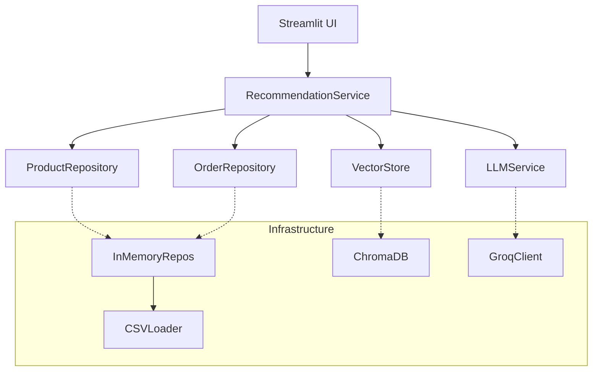

# SmartCart AI - Walkthrough

I have successfully built the **SmartCart AI** product recommendation engine. The project follows Clean Architecture and is ready for local execution or Docker deployment.

## 📂 Project Structure

Verified file creation:
- **Domain**: `src/domain/entities.py`, `src/domain/interfaces.py`
- **Infrastructure**: `src/infrastructure/db/csv_loader.py`, `src/infrastructure/db/vector_store.py`, `src/infrastructure/llm/groq_client.py`
- **Application**: `src/application/recommendation_service.py`
- **Interface**: `src/interface/streamlit_app.py`
- **Tests**: `tests/` (Domain, Service, CSV Loader)
- **Config**: `pyproject.toml`, `Makefile`, `Dockerfile`, `docker-compose.yml`

## 🏗 Architecture Diagram



## 🚀 How to Run

1.  **Install**:
    ```bash
    make install
    ```
2.  **Run**:
    ```bash
    # You will need a Groq API Key
    make run
    # Or enter key in the UI Sidebar
    ```
3.  **Test**:
    ```bash
    make test
    ```

## ✅ Features Implemented

- **Product Catalog**: Browsable list of dummy tech products.
- **Cart**: Add items to cart.
- **AI Recommendations**: 
    - Analyzes User History (mocked/recent from CSV) and Current Cart.
    - Uses Groq LLM to generate explainable recommendations.
    - "Because you bought a Laptop, you might need a Mouse..."
